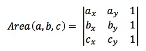

# Week 4: Search in Continuous Space

## Probabilistic Roadmap

State Space -> State Graph - Search in Graph

- Use sampling to construct the state graph
- Components:
    - Sampling strategy (adding vertices)
    - Connection strategy (adding edges)
    - Check if a configuration is valid or not
    - Check if a line segment in C-space is valid or not

## State Graph (Roadmap) construction
```
loop:
    Sample a configuration q with a suitable sampling strategy
    if q is collision free then:
        Add q to the graph G
        Connect q to existing vertices in G using valid edges
```

## Sampling Strategies

### Sample near obstacles

- Sample a configuration (q1) uniformly at random
- Sample a configuration (q2) from the set of all configurations within D distance from q1, uniformly at random
- If q1 is in-collision and q2 is collision free:
    - Add q2 as a vertex in the state graph
- Else if q1 is collision free and q2 is in collision:
    - Add q1 as a vertex in the state graph

### Sample inside a passage

- Sample a configuration (q1) uniformly at random
- Sample a configuration (q2) from the set of all configurations within D distance from q1, uniformly at random
- If q1 and q2 are in-collision:
    - Check if the middle configuration `qm = 0.5(q1 + q2)` is collision free
    - If qm is collision free, add qm as a vertex in the state graph

### Using workspace information

- Narrow passages in C-space are often caused by narrow passes in the workspace
- Relax problem into planning for a point robot
    - Discretize the workspace into uniform grid
    - Choose a point r on the robot
    - Find a path t assuming the robot is at point r
    - t: sequence of grid cells
- To sample a configuration
    - Sample a cell c in t with equal probability
    - Sample a point p uniformly at random from c
    - Sample a configuration uniformly at random from the set of all configurations that place point r of the robot at p

### Combining sampling strategies

- Analogous to combining heuristics
- See multi arm bandit problem
- How to combine:
    - Simplest:
        - Assign equal weight to each candidate sampling strategy
        - Choose a strategy to use randomly based on the weight
        - Use the chosen strategy to sample a configuration
        - Repeat the above steps, without changing the weight

## Multi Arm Bandit Problem

Scenario is a casino, each arm on a machine is a sampling strategy.

Choose which 'arm' would be most helpful in solving the problem.

Key: trading off exploration vs exploitation:
- Use the sampling strategy that has been shown to be useful, but it may not be the best strategy (__exploitation__).
- Use other sampling strategy that may not have shown good performance yet, but may actually be the best strategy (__exploration__)

The multi arm bandit problem has many solutions:

- Simplest: epsilon-greedy
    - Assign a weight to each sampling strategy
    - Start with equal weight for all strategies
    - Strategy with the highest weight is selected with probability (1-e). The rest are selected with probability e/N, where N is the number of strategies.
    - Suppose strategy s1 is selected, we will use s1 to sample add a vertex and edges to the roadmap. If the addition connects disconnected components of the roadmap or adds a new connection, increment the weight of s1 by 1.

## Collision Checking

### Primatives



### Line Segment

Suppose we have 2 line segments: p1q1 and p2q2. The line segments intersect whenever:

- Majority of cases:
    - If p1q1p2 and p1q1q2 have different orientations and
    - p2q2p1 and p2q2q1 have different orientations

- Special cases: All co-linear segments will intersect when:
    - The x components of the first segment intersects with that of the second segment and
    - The y components of the first segment intersects with that of the second segment

### More Efficient Line Segment Check

- Bound the line segments with axis-aligned rectangles
- Check intersections between rectangles
    - Only need to check range of x and y
- Only if the bounding rectangles intersect that we perform the collision check above.

### Hierachical Bounding Volume

- A more general collision check.
- Suppose we have an object O, whose boundary is represented by geometric primitives, e.g.
    - The primitives of a polygon are short line segments
    - The primitives of a polyhedron (represented as a triangular mesh) are triangles.

- __Implementation__
    - Construct a tree of bounding volumes for each object we want to check
        - Each node represents a bounding volume (sphere / box)
        - The root covers the entire object. Each leaf node covers a geometric primitive of the object
        - Construct bottom up
    - Use the tree of bounding volumes to quickly check collision between the objects

### Hierarchical Bounding Volume Distance Computation

- Can be used to compute distance too
- Suppose we want to compute the distance between a point p and a object O
    - Construct the tree of hierarchical bounding volume for O
        - Recursive DFS to compute distance between p and the nodes of the tree
        - Only traverse down a subtree when needed

## Where do we gain efficiency

- The hope is that we don't need to compute distance with all geometric primitives
    - If we do, then we don't gain anything using this method
    - However, in most practical scenarios, this methods do eliminate a lot of distance computation between the point and geometric primitive of the object.

## Why sampling strategies work

- There are abundant solutions, we only need one
- In most free spaces of real world problems every configuration 'sees' a significant fraction of the free space
- A relatively small number of vertices and edges are sufficient to cover most free spaces with high probablity and hence solve the given queries

### Formal Definition
- The lookout of a subset F1 of the free space is the set of all configurations in F1 from which it is possible to 'see' a significant fraction of the free space outside F1.
    - Beta-lookup (F1): The set of all configurations in F1 from which it is possible to 'see' beta fraction of the free space outside F1
- The free space F is expansive if all of its subsets have a large lookout
- If we know alpha and beta of the free space, we can compute the number of samples to solve a given problem with high probability.
- But, to compute alpha and beta, we need the geometry of the free space
    - PRM is successful exactly because its not computing the geometry of the free space
    - Practically, we don't know alpha and beta, nor the exact number of samples to use
- Why bother?
    - Sometimes we can 'guess' alpha and beta from the workspace, thus know when to use PRM and when not
    - Guarantees that we will eventually get a solution if a solution exists
