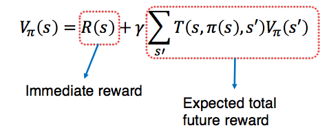

# Week 8: Markov Chains

## Markov Decision Processes (MDP)
- A framework to find the best sequence of actions to perform when the outcome of each action is non-deterministic
- Example:
    - Games: Tic-Tac-Toe, Chess, Go
    - Races: Bicycle race, car race
    - Navigation
- The non-determinism must be Markov
- Markov means given the present state, the future states are independent from the past states

## Defining a MDP Problem
- Formally defined as 4 tuples
- (S, A, T, R):
    - S: State space
    - A: Action space
    - T: Transition function
    - R: Reward function

## Example: Simple navigation
- An agent moves in 4x3 grid cells
- It can move to one of four neighboring cells. The actions' accuracy is 70%.
30% of the time, the agent ends up at the left or right of it's intended cell, or at the current cell, with equal probability. If there's no cell in the left or right of its intended cell, the probability mass is added to staying where it is.
- Collision with obstacle/boundary will result in no movement
- Two terminal states, with reward +1 and -1. All other actions incur a cost of -0.04


- Define MDP
    - S: {1, 2, 3, 4, 5, 6, 7, 8, 9, 10, 11, 12} (Position in grid)
    - A: {Left, Right, Down, Up}
    - T:

| Right from cell 7       |
| ----------------------- |
| P(8 \| 7, right) = 0.7  |
| P(4 \| 7, right) = 0.1  |
| P(12 \| 7, right) = 0.1 |
| P(3 \| 7, right) = 0    |
| P(11 \| 7, right) = 0   |
| P(7 \| 7, right) = 0.1  |

P(8 | 7, right) = Probability of reaching 8, given starting cell at 7 and moving right

Note: The above is only for a single move from a cell, the actual transition function would look like more of a 2d matrix

- R:
    - R(1) = 
    - R(2) = 
    - R(4) = +1
    - R(8) = -1
    ...

## What is the solution of an MDP Problem
- An optimal __policy__, usually donoted as pi*
    - Policy = strategy
    - A mapping from states to actions pi: S -> A
    - Meaning for any state s in S, pi(s) will tell us what action the agent should take

## Using a Policy
1. Starts from the initial state
2. Move according to the policy
3. The agent moves to a new state
    - The new state the agent ends up may be different in different runs
4. Repeat from 2 until criteria is satisfied (e.g. goal is reached)

- After each step (e.g. after performing an action), the agent receives a reward
- The goal of an MDP agent is to perform actions, so as to gather the highest total reward possible
    - Problem: Since where the agent will be after performing the action is not certain, the total reward for performing a sequence of actions (following a particular policy) is also not certain

## What does "best" mean?
- Different criteria
- Maximise one of the folling
    - Myopic
    - Finite horizon
        - Optimal policy: Non stationary
    - Infinite horizon
        - Optimal policy: Stationary

## Value function
- The expected total reward the agent will gather if it executes a policy pi is usually called the value function, and is denoted by Vpi.



- Each policy has a corresponding value function
- An optimal policy pi* is the policy whose corresponding value function is the maximum
    - Meaning at each state, Vpi(s) is higher than (or at least the same as) Vpi for any other policy pi
    - Vpi is often a simplified as V

## Computing policy offline
- Compute policy before runtime
- During runtime, only use the policy
    - Can think of the policy as a lookup table

## Value Iteration
- Iterate calculating the optimal value of a state until convergence
- Algorithm:
```
Initialize V0(s) = R(s) for all s
Loop:
    For all s {
        Bellman update (see lecture notes)
    }
    t = t + 1
    Until V^(t+1)(s) = V^t(s) for all s
```

## Using Value Iteration

1. Write down the current values (e.g. The reward for each tile)
2. Calculate each possible state and find the expected result

## Problem: Large state space
- So far, we assume we can store the values of all states and update the value of each state sufficiently often
- Infeasible in large state space, especially continous state space
- Polynomial time algorithm for large state space still not fast enough
- Not all states are relevant
    - Focus Bellman Update on relevant states only
    - More compact policy representation

## Policy Representation
- Tree (AND-OR tree), where the root is the initial state
    - Don't care about states that are unreachable from the initial state
- Parametric function
    - Usually, parametric function to define the value function
