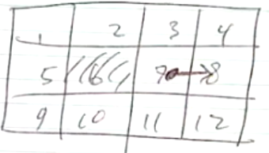

# Week 8: Markov Chains

## Markov Decision Processes (MDP)
- A framework to find the best sequence of actions to perform when the outcome of each action is non-deterministic
- Example:
    - Games: Tic-Tac-Toe, Chess, Go
    - Races: Bicycle race, car race
    - Navigation
- The non-determinism must be Markov
- Markov means given the present state, the future states are independent from the past states

## Defining a MDP Problem
- Formally defined as 4 tuples
- (S, A, T, R):
    - S: State space
    - A: Action space
    - T: Transition function
    - R: Reward function

## Example: Simple navigation
- An agent moves in 4x3 grid cells
- It can move to one of four neighboring cells. The actions' accuracy is 70%.
30% of the time, the agent ends up at the left or right of it's intended cell, or at the current cell, with equal probability. If there's no cell in the left or right of its intended cell, the probability mass is added to staying where it is.
- Collision with obstacle/boundary will result in no movement
- Two terminal states, with reward +1 and -1. All other actions incur a cost of -0.04

- Define MDP
    - S: {1, 2, 3, 4, 5, 6, 7, 8, 9, 10, 11, 12} (Position in grid)
    - A: {Left, Right, Down, Up}
    - T:

| Right from cell 7       |
| ----------------------- |
| P(8 \| 7, right) = 0.7  |
| P(4 \| 7, right) = 0.1  |
| P(12 \| 7, right) = 0.1 |
| P(3 \| 7, right) = 0    |
| P(11 \| 7, right) = 0   |
| P(7 \| 7, right) = 0.1  |

P(8 | 7, right) = Probability of reaching 8, given starting cell at 7 and moving right

Note: The above is only for a single move from a cell, the actual transition function would look like more of a 2d matrix

    - R:
        - R(1) = 
        - R(2) = 
        - R(4) = +1
        - R(8) = -1
        ...
