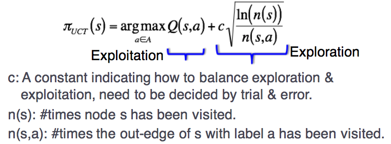

# Week 9: MDP and POMDP

## Computing the Policy Online
- Problems with the offline strategy:
    - Large state and action spaces
    - Even a single backup operation can be expensive
- Interleave policy computation with using the policy
- Focus on finding the optimal policy for the present state only
- In general, relax the optimality requirement to approximately optimal

## Realtime Dynamic Programming (RDTP)
- Repeat until planning time ran out
    - Simulate greedy policy from starting state until a goal state is reached
    - Perform Bellman backup on visited states

```
s0 = Initial state
G = Goal set

s = s0
while (s is not in G):
    a_greedy = argmax_a Q(s, a)
    V(s) = Q(s, a_greedy)
    s' = sampleFrom(T(s, a, s') and set s = s'

```

## Example: Simple Navigation
- An agent moves in 4x3 grid cells
- It can move to one of four neighboring cells. THe actions accuracy is 70%.
- 30% of the time, the agent ends up at the left or right of its intended cell, or at the current cell with equal probability. If there's no cell in the left or right of its intended cell, the probability mass is added to staying where it is.
- Collision with obstacle/boundary will result in no movement
- Two terminal states, with reward +1 and -1. All other actions incur a cost of -0.04

## RTDP Solution
- Converge to optimality when #iterations goes to infinity
- Drawbacks
    - No real termination condition
    - May perform backup at state s repeatedly even when the value of s has converged to the optimal value

## Labeled RTDP
- Check if the value of a state can no longer improve (isSolved function in the following algorithm)
    - If the value of a state s and all its descendent (that have been visited) change less than a small value e, label s as solved

```
s0 = Initial state
G = Goal set

s = s0
while (s is not in G):
    a_greedy = argmax_a Q(s, a)
    V(s) = Q(s, a_greedy)
    s' = sampleFrom(T(s, a, s'), add s' to list L and set s = s'

For all state s in L, if (isSolved(s)) Label s as solved
```

## Monte Carlo Tree Search (MCTS)
- Combines tree search and Monte Carlo
- Monte Carlo
    - A sampling based method to approximate the value of complicated functions, i.e. the ones too difficult or time consuming to compute exactly
    - In MDP, can be used to approximate the expected total future reward if the agent follows an optimal policy

- Build a search tree based on the outcomes of the simulated plays
- Iterate over 4 main components
    - Selection: Choose the best path
    - Expansion: When a terminal node is reached, add a child node
    - Simulation: Simulate from the newly added node n, to estimate its value
    - Backpropagation: Update the value of the nodes visited in this iteration
- Many variants for each component
- The value Q(s, a) is the average total discounted reward over the simulations that start from __s__ and performs action __a__ as its first action.
- Does not need the exact transition and reward model
    - Only need a simulator
    - Computes a good policy by interacting with the simulator

## Node Selection
- Multi-armed bandit to select which action to use
    - In general, use a method called Upper Confidence Bound (UCB)
    - Choose an action __a__ to perform at __s__ as:


- MCTS + UCB is often called Upper Confidence Bound for Trees (UCT)

## Simulation
- Often called rollout
- Essentially, a way to estimate the optimal value of the newly added state
- In practise:
    - Use heuristic, e.g. greedy, solution of deterministic case
    - Important for performance

## Backpropagation
- Essentially, updating the Q values
    - Q(s, a) = (Q(s, a)XN(s, a) + q) / (N(s, a) + 1)
    - N(s) = N(s) + 1
    - N(s, a) = N(s, a) + 1


## Recall: Using a Policy for a MDP Agent
1. Starts from the initial state
2. Move according to policy
3. The agent moves to a new state
    - The new state the agent ends up may be different in different runs
4. Repeat to 2 until stopping criteria is satisfied (e.g. goal is reached)

### Partially Observable Markov Decision Processes
- Belief: Distrubtion over the state space
- Stategy/Policy: Mapping from beliefs to actions

### POMDP Model
- Main Components
    - State Space (S): Not known
    - Action Space (A)
    - Observation Space (O)
    - Transition function (T)
    - Observation function (Z)
    - Reward function (R)

## Belief
- Belief can be represented as parametric distributions
- __Discrete Cases__
    - Bernoulli
    - Binomial
    - Geometric
    - Poisson
    - Hyper geometric
    - Uniform
- __Continous Cases__
    - Uniform
    - Exponential
    - Gamma
    - Normal, Gaussian

## Value Function
- The expected total reward the agent will gather if it executes a policy pi is ually callewd the value function.

## POMDP Solution
- Similar to MDP, we are looking for a policy that maximises the value of all beliefs
- In practise:
    - Policy that maximises the value of beliefes reachable from the initial beliefs b0
    - Event further, policy whose values at the beliefs reachable from b0 is close to the best values

## How to compute the next belief?
- Intuitively, divide into 2 steps
    - Compute the next belief after an action is performed
    - Adjust the belief based on the perceived observation
- Mathematically:
    - Use Bayes rule

## How to implement, Particle Filter
- Represent distributions as particles
    - Basically as a set of single states
        - Can be weighted or unweighted
    - The number of sets at a certain region, represents the probability

- Recall 2 steps:
    - Effect of action a: For each particle s, compute next particle by sampling from transition function T (i.e, P(S' | s, a))
    - Effect of observation o:
        - Assign weight to the samples, based on Bayes rule on Z
        - Resample based on the weight


